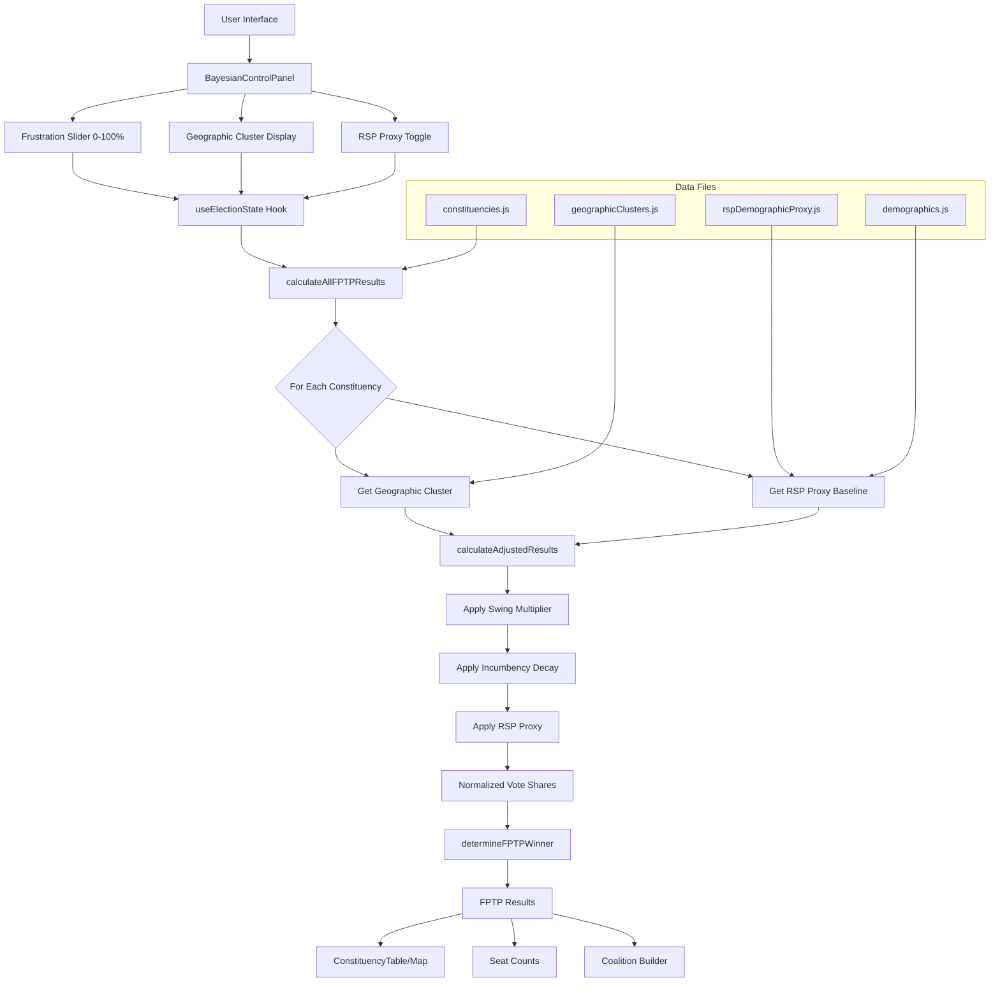

# Advanced Simulator Features Implementation Plan

## Overview
This plan outlines the implementation of three advanced features for the Nepal Election Simulator:
1. **Incumbency Decay (Selection Bias)** - Voter frustration slider affecting incumbent win probability
2. **Geographic Cluster Elasticity** - Different swing multipliers for different geographic clusters
3. **RSP Effect (Demographic Proxying)** - Project RSP performance to similar districts using seed data

---

## Feature 1: Incumbency Decay (Selection Bias)

### Logic
- Nepali party elites often struggle with "selection bias," prioritizing loyalty over voter preference
- Voter rankings only explain about one-third of candidate selections
- Simulates "Voter Frustration" with the status quo (14 governments in 15 years)
- When frustration slider is at 100%, incumbent win probability drops by 0.8×

### Implementation Details

#### 1.1 Update BayesianControlPanel.jsx
- **Current state**: Slider range is 0-0.25 (0-25%)
- **Required change**: Expand range to 0-1.0 (0-100%)
- **Label update**: Change from "25% frustration" to "100% frustration"
- **Description update**: "Applies a win-probability haircut to 2022 winners in each seat. At 100%, incumbents lose 80% of their win probability advantage."

#### 1.2 Update calculateAdjustedResults() in calculations.js
- Add `incumbencyDecay` parameter (0-1.0)
- After calculating adjusted vote shares, apply incumbency penalty:
  ```javascript
  // If this constituency had a 2022 winner, apply decay
  if (baselineWinner && incumbencyDecay > 0) {
    const incumbentParty = baselineWinner;
    const incumbentShare = adjusted[incumbentParty];
    const decayFactor = 1 - (incumbencyDecay * 0.8); // Max 80% reduction
    adjusted[incumbentParty] = incumbentShare * decayFactor;
    
    // Redistribute decayed votes proportionally to other parties
    const decayedAmount = incumbentShare - adjusted[incumbentParty];
    redistributeVotes(adjusted, incumbentParty, decayedAmount);
  }
  ```

#### 1.3 Update useElectionState.js
- Pass `incumbencyDecay` to `calculateAllFPTPResults()`
- Ensure it flows through the calculation pipeline

---

## Feature 2: Geographic Cluster Elasticity

### Logic
- National "Waves" do not hit every part of Nepal with equal force
- Urban youth-driven waves penetrate metropolitan areas much faster than isolated mountain strongholds
- Group 165 seats into four distinct clusters with different swing multipliers

### Cluster Definitions

| Cluster | Description | Swing Multiplier | Example Districts |
|---------|-------------|------------------|-------------------|
| Metropolitan | Major cities, high urbanization (>70%), high youth density | 1.8× | Kathmandu, Lalitpur, Bhaktapur, Pokhara, Butwal, Dharan, Biratnagar |
| Terai Urban | Urban areas in Terai belt, moderate urbanization (30-70%) | 1.2× | Birgunj, Janakpur, Nepalgunj, Butwal (Terai side) |
| Hilly Rural | Rural hilly areas, low urbanization (<30%), traditional party strongholds | 0.7× | Most hill districts outside major cities |
| Mountain | Remote mountain districts, very low urbanization (<15%), isolated | 0.3× | Solukhumbu, Mustang, Dolpa, Mugu, Humla |

### Implementation Details

#### 2.1 Create data/geographicClusters.js
```javascript
export const GEOGRAPHIC_CLUSTERS = {
  // Metropolitan: Major cities with >70% urbanization
  metropolitan: [
    'P3-Kathmandu-1', 'P3-Kathmandu-2', 'P3-Kathmandu-3', 'P3-Kathmandu-4',
    'P3-Kathmandu-5', 'P3-Kathmandu-6', 'P3-Kathmandu-7', 'P3-Kathmandu-8',
    'P3-Kathmandu-9', 'P3-Kathmandu-10',
    'P3-Lalitpur-1', 'P3-Lalitpur-2', 'P3-Lalitpur-3',
    'P3-Bhaktapur-1', 'P3-Bhaktapur-2',
    'P3-Pokhara-1', 'P3-Pokhara-2', // (if exists)
    'P1-Biratnagar-1', 'P1-Biratnagar-2', // (if exists)
    // ... add more metropolitan seats
  ],
  
  // Terai Urban: Urban areas in Terai with 30-70% urbanization
  teraiUrban: [
    'P2-Birgunj-1', 'P2-Birgunj-2', // (if exists)
    'P2-Janakpur-1', 'P2-Janakpur-2', // (if exists)
    'P5-Butwal-1', 'P5-Butwal-2', // (if exists)
    'P5-Nepalgunj-1', 'P5-Nepalgunj-2', // (if exists)
    // ... add more Terai urban seats
  ],
  
  // Hilly Rural: Default for hilly areas not in Metropolitan
  hillyRural: [
    // Most hill districts
    // ... add hilly rural seats
  ],
  
  // Mountain: Remote mountain districts
  mountain: [
    'P1-Solukhumbu-1',
    'P4-Mustang-1', // (if exists)
    'P6-Dolpa-1', // (if exists)
    'P6-Mugu-1', // (if exists)
    'P6-Humla-1', // (if exists)
    // ... add more mountain seats
  ],
};

export const SWING_MULTIPLIERS = {
  metropolitan: 1.8,
  teraiUrban: 1.2,
  hillyRural: 0.7,
  mountain: 0.3,
};

// Helper function to get cluster for a constituency
export function getConstituencyCluster(constituencyId) {
  for (const [cluster, seats] of Object.entries(GEOGRAPHIC_CLUSTERS)) {
    if (seats.includes(constituencyId)) {
      return cluster;
    }
  }
  return 'hillyRural'; // Default
}
```

#### 2.2 Update calculateAdjustedResults() in calculations.js
- Add geographic cluster logic to amplify/reduce swing effects:
  ```javascript
  export function calculateAdjustedResults(
    baseline, 
    globalShifts, 
    initialValues = INITIAL_NATIONAL,
    incumbencyDecay = 0,
    geographicCluster = 'hillyRural'
  ) {
    const parties = Object.keys(baseline);
    const adjusted = {};
    
    // Get swing multiplier for this cluster
    const swingMultiplier = SWING_MULTIPLIERS[geographicCluster] || 1.0;
    
    parties.forEach(party => {
      // Calculate shift: (current slider - initial slider) / 100
      const shift = (globalShifts[party] - initialValues[party]) / 100;
      // Apply swing multiplier to amplify/reduce effect
      const adjustedShift = shift * swingMultiplier;
      // Apply to baseline, clamped between 0.01 and 0.99
      adjusted[party] = Math.max(0.01, Math.min(0.99, baseline[party] + adjustedShift));
    });
    
    // Normalize to sum to 1
    const total = Object.values(adjusted).reduce((a, b) => a + b, 0);
    parties.forEach(party => {
      adjusted[party] = adjusted[party] / total;
    });
    
    // Apply incumbency decay if applicable
    if (incumbencyDecay > 0) {
      // ... incumbency logic
    }
    
    return adjusted;
  }
  ```

#### 2.3 Update calculateAllFPTPResults() in calculations.js
- Pass cluster information to each constituency's calculation:
  ```javascript
  constituencies.forEach(constituency => {
    const id = constituency.id;
    const cluster = getConstituencyCluster(id);
    
    // ... existing logic
    
    adjustedVotes = calculateAdjustedResults(
      constituency.results2022, 
      globalSliders, 
      baselineValues,
      incumbencyDecay,
      cluster
    );
    // ...
  });
  ```

---

## Feature 3: RSP Effect (Demographic Proxying)

### Logic
- Demographic Proxying (Small Area Estimation) solves "Ghost Seat" problem
- Takes performance of a party in areas where they won and applies it to all similar areas
- Use 8 RSP seed seats from 2022 to project performance onto similar districts
- If a district is Metropolitan with 15-24 age demographic >20%, default RSP baseline to mean of seed seats

### RSP Seed Seats (2022 Winners)

| Seat ID | District | Winner | Vote Share | Notes |
|---------|----------|--------|------------|-------|
| P3-Kathmandu-2 | Kathmandu | Sobita Gautam | ~30% | Urban, youth-heavy |
| P3-Kathmandu-6 | Kathmandu | Shishir Khanal | ~30% | Urban, youth-heavy |
| P3-Kathmandu-7 | Kathmandu | Ganesh Parajuli | ~30% | Urban, youth-heavy |
| P3-Kathmandu-8 | Kathmandu | Biraj Bhakta Shrestha | ~30% | Urban, youth-heavy |
| P3-Lalitpur-3 | Lalitpur | Toshima Karki | ~30% | Urban, youth-heavy |
| P3-Chitwan-1 | Chitwan | Hari Dhakal | ~30% | Semi-urban |
| P3-Chitwan-2 | Chitwan | Rabi Lamichhane | ~30% | Semi-urban |
| P4-Tanahun-1 | Tanahun | Swarnim Wagle | ~30% | By-election victory |

### Implementation Details

#### 3.1 Create data/rspDemographicProxy.js
```javascript
import { DISTRICT_DEMOGRAPHICS } from './demographics';

// RSP seed seats from 2022
export const RSP_SEED_SEATS = [
  'P3-Kathmandu-2',
  'P3-Kathmandu-6',
  'P3-Kathmandu-7',
  'P3-Kathmandu-8',
  'P3-Lalitpur-3',
  'P3-Chitwan-1',
  'P3-Chitwan-2',
  'P4-Tanahun-1',
];

// Calculate mean characteristics of RSP seed districts
export function calculateRSPSeedCharacteristics() {
  const seedDistricts = ['Kathmandu', 'Lalitpur', 'Chitwan', 'Tanahun'];
  
  const characteristics = {
    urbanization: 0,
    youthDensity: 0, // 15-29 age group
    literacyRate: 0,
  };
  
  seedDistricts.forEach(district => {
    const demo = DISTRICT_DEMOGRAPHICS[district];
    if (demo) {
      characteristics.urbanization += demo.urbanPopulation;
      characteristics.youthDensity += (demo.ageGroups['15-29'] || 0);
      characteristics.literacyRate += demo.literacyRate;
    }
  });
  
  const count = seedDistricts.length;
  return {
    urbanization: characteristics.urbanization / count,
    youthDensity: characteristics.youthDensity / count,
    literacyRate: characteristics.literacyRate / count,
  };
}

// Calculate mean RSP vote share in seed seats
export function calculateRSPSeedBaseline(constituencies) {
  const seedResults = RSP_SEED_SEATS.map(seatId => {
    const constituency = constituencies.find(c => c.id === seatId);
    return constituency?.results2022?.RSP || 0;
  }).filter(v => v > 0);
  
  if (seedResults.length === 0) return 0;
  return seedResults.reduce((sum, v) => sum + v, 0) / seedResults.length;
}

// Check if constituency should use RSP proxy baseline
export function shouldUseRSPProxy(constituency, demographics, seedCharacteristics, threshold = 0.02) {
  const demo = demographics[constituency.district];
  if (!demo) return false;
  
  // Check if district is similar to seed districts
  const urbanizationDiff = Math.abs(demo.urbanPopulation - seedCharacteristics.urbanization);
  const youthDiff = Math.abs((demo.ageGroups['15-29'] || 0) - seedCharacteristics.youthDensity);
  
  // Use proxy if within threshold AND constituency is in Metropolitan cluster
  const isSimilar = urbanizationDiff < threshold && youthDiff < threshold;
  const isMetropolitan = demo.urbanPopulation > 0.5; // >50% urbanization
  
  return isSimilar && isMetropolitan;
}

// Get RSP proxy baseline for a constituency
export function getRSPProxyBaseline(constituency, constituencies, demographics) {
  const seedCharacteristics = calculateRSPSeedCharacteristics();
  const rspSeedBaseline = calculateRSPSeedBaseline(constituencies);
  
  if (shouldUseRSPProxy(constituency, demographics, seedCharacteristics)) {
    // Return mean RSP performance from seed seats
    return rspSeedBaseline;
  }
  
  // Return actual 2022 result (may be 0 for "ghost seats")
  const constituencyData = constituencies.find(c => c.id === constituency.id);
  return constituencyData?.results2022?.RSP || 0;
}
```

#### 3.2 Update calculateAdjustedResults() in calculations.js
- Add RSP proxy logic to handle "ghost seats":
  ```javascript
  export function calculateAdjustedResults(
    baseline, 
    globalShifts, 
    initialValues = INITIAL_NATIONAL,
    incumbencyDecay = 0,
    geographicCluster = 'hillyRural',
    useRSPProxy = false,
    rspProxyBaseline = 0
  ) {
    const parties = Object.keys(baseline);
    const adjusted = { ...baseline };
    
    // Apply RSP proxy if enabled and this is a "ghost seat"
    if (useRSPProxy && baseline.RSP === 0 && rspProxyBaseline > 0) {
      adjusted.RSP = rspProxyBaseline;
      // Redistribute from other parties proportionally
      redistributeVotes(adjusted, 'RSP', rspProxyBaseline);
    }
    
    // ... rest of existing logic with geographic cluster and incumbency
    
    return adjusted;
  }
  ```

#### 3.3 Update useElectionState.js
- Add state for RSP proxy enablement
- Calculate RSP proxy baselines for all constituencies
- Pass to calculation functions

---

## System Architecture Diagram



---

## Implementation Order

1. **Phase 1: Data Preparation**
   - Create `data/geographicClusters.js` with all 165 seats classified
   - Create `data/rspDemographicProxy.js` with RSP seed data and proxy logic

2. **Phase 2: Core Calculation Updates**
   - Update `calculateAdjustedResults()` to accept new parameters
   - Add geographic cluster swing multiplier logic
   - Add incumbency decay logic
   - Add RSP proxy logic

3. **Phase 3: State Management Updates**
   - Update `useElectionState.js` to manage new parameters
   - Calculate RSP proxy baselines on initialization

4. **Phase 4: UI Updates**
   - Update `BayesianControlPanel.jsx` frustration slider range
   - Add RSP proxy toggle (optional, can be auto-enabled)

5. **Phase 5: Testing and Validation**
   - Test incumbency decay at 0%, 50%, 100%
   - Test geographic cluster multipliers with various slider combinations
   - Test RSP proxy in "ghost seats" vs actual RSP seats

---

## Key Considerations

### Incumbency Decay
- The 0.8× factor at 100% frustration means incumbents lose 80% of their advantage
- Must redistribute decayed votes proportionally to maintain vote share sum = 1
- Should only apply to the 2022 winner in each constituency

### Geographic Clusters
- Default cluster is 'hillyRural' for any unclassified seats
- Swing multipliers amplify/reduce the effect of slider changes
- Metropolitan seats are most responsive to "wave" effects

### RSP Proxy
- Only applies to constituencies where RSP got 0% in 2022 ("ghost seats")
- Only applies if district demographics match seed characteristics
- Helps predict RSP breakthrough potential in cities like Pokhara, Butwal, Dharan

---

## Testing Checklist

- [ ] Frustration slider at 0%: No incumbency penalty applied
- [ ] Frustration slider at 50%: 40% incumbency penalty (0.5 × 0.8)
- [ ] Frustration slider at 100%: 80% incumbency penalty
- [ ] Metropolitan cluster: 1.8× swing multiplier applied
- [ ] Mountain cluster: 0.3× swing multiplier applied
- [ ] RSP proxy: Ghost seats in similar districts get seed baseline
- [ ] Vote shares always sum to 1.0 after all adjustments
- [ ] All 165 constituencies classified into clusters
- [ ] RSP seed seats correctly identified (8 seats)

---

## Files to Create/Modify

### New Files
1. `data/geographicClusters.js` - Geographic cluster classifications
2. `data/rspDemographicProxy.js` - RSP seed data and proxy logic

### Modified Files
1. `src/utils/calculations.js` - Core calculation logic updates
2. `hooks/useElectionState.js` - State management for new parameters
3. `components/BayesianControlPanel.jsx` - UI updates for frustration slider

### Optional Files
1. `components/GeographicClusterDisplay.jsx` - Visual cluster display (future enhancement)
