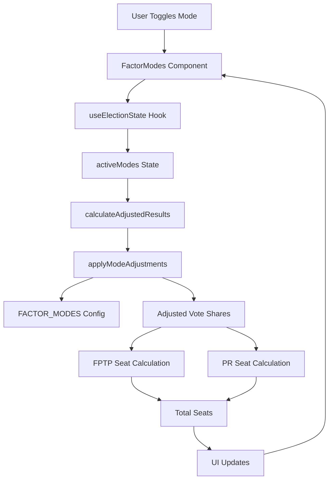
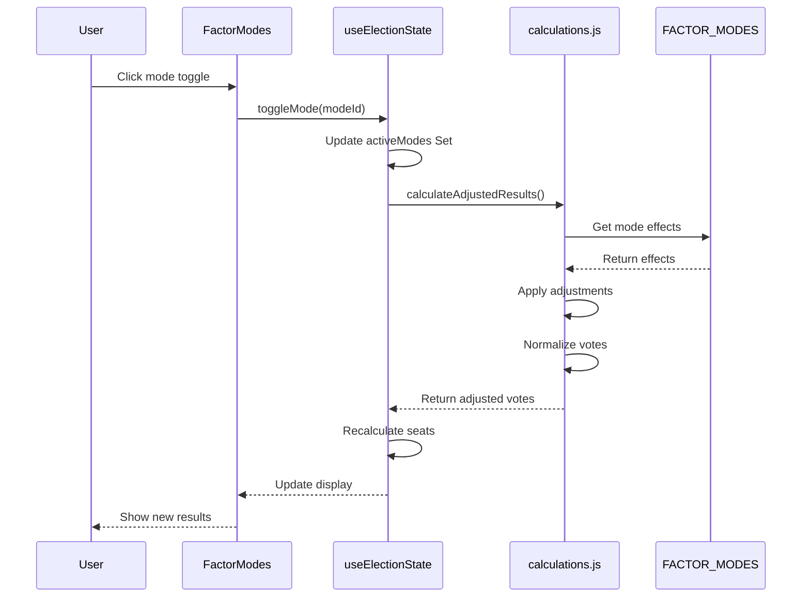
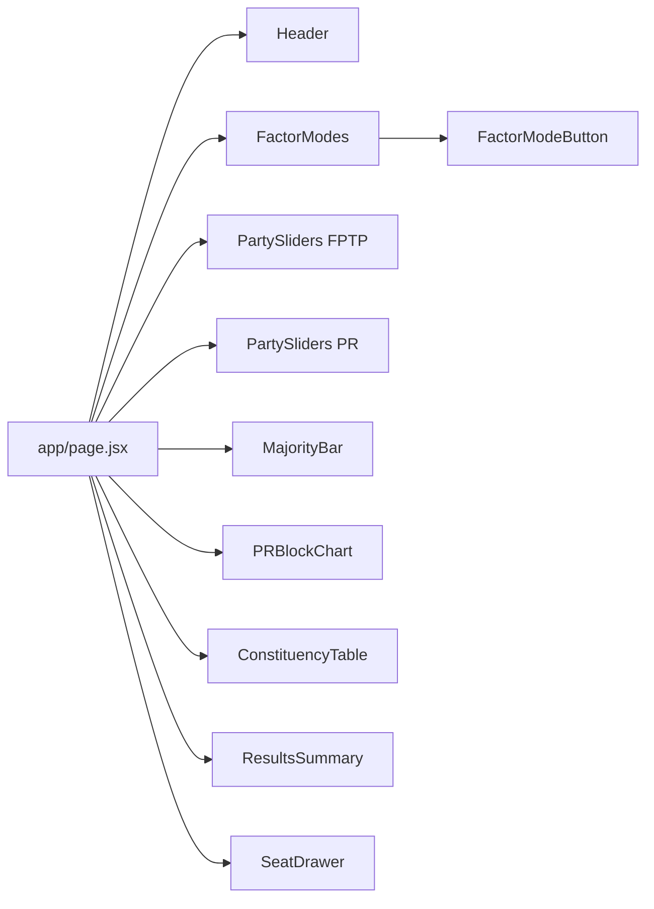

# Cute Modes Feature - Architecture Plan

## System Architecture Diagram



## Data Flow Diagram



## Component Hierarchy



## Overview
Add 4 toggleable "cute modes" representing Nepali political factors that can be combined to simulate different electoral scenarios. Each mode applies vote share adjustments to political parties.

## Design Decisions

### 1. Mode Scope & Application
- **Voting Systems**: Affects both FPTP and PR equally
- **Geographic**: Applies nationwide (all 165 constituencies)
- **Combination**: Stack additively (multiple modes can be active simultaneously)
- **UI Placement**: Above the FPTP/PR sliders in main page layout

### 2. Political Factors (4 Modes)

| Mode | Icon | Description | Primary Effect | Secondary Effects |
|------|------|-------------|----------------|-------------------|
| **Balen Factor** | 👓 | Balen Shah (Kathmandu Mayor) - Populist appeal, youth magnet | +8% RSP | -4% NC, -4% UML |
| **Rabi Factor** | 🔔 | Rabi Lamichhane (RSP Leader) - TV personality, charismatic | +6% RSP | -3% NC, -3% UML |
| **Oli Disaster** | 💥 | K.P. Oli (UML Leader) - Controversial, anti-incumbency | -7% UML | +7% RSP |
| **Deuba Disaster** | 🌪️ | Sher Bahadur Deuba (NC Leader) - Traditional politics fatigue | -6% NC | +6% RSP |

### 3. Vote Adjustment Logic

#### Calculation Formula
For each party, the final vote share is calculated as:

```
adjustedVote = baseVote + Σ(modeEffects)
```

Where:
- `baseVote` = Original vote share from slider or baseline
- `modeEffects` = Sum of all active mode effects for that party

#### Constraints
- Minimum vote share: 0.5% (to prevent parties from disappearing)
- Maximum vote share: 60% (to prevent unrealistic dominance)
- After applying mode effects, votes are re-normalized to maintain 100% total

#### Example Calculation
With "Balen Factor" (+8% RSP, -4% NC, -4% UML) and "Oli Disaster" (-7% UML, +7% RSP):

```
NC: 25% - 4% = 21%
UML: 27% - 4% - 7% = 16%
Maoist: 11% (unchanged)
RSP: 11% + 8% + 7% = 26%
Others: Unchanged
```

Then normalize to sum to 100%.

## Architecture Components

### 1. Data Layer

#### File: `src/data/modes.js`
```javascript
export const FACTOR_MODES = {
  balen: {
    id: 'balen',
    name: 'Balen Factor',
    icon: '👓',
    description: 'Kathmandu Mayor effect',
    effects: {
      RSP: 6,
      RPP: 2,
    },
    color: '#3b82f6', // Blue (RSP color)
  },
  rabi: {
    id: 'rabi',
    name: 'Rabi Factor',
    icon: '🔔',
    description: 'TV personality charisma',
    effects: {
      RSP: 5,
      JP: 1,
    },
    color: '#3b82f6', // Blue (RSP color)
  },
  oli: {
    id: 'oli',
    name: 'Oli Disaster',
    icon: '💥',
    description: 'Anti-incumbency wave',
    effects: {
      UML: -5,
      NC: 2,
      Maoist: 1,
    },
    color: '#ef4444', // Red (UML color)
  },
  deuba: {
    id: 'deuba',
    name: 'Deuba Disaster',
    icon: '🌪️',
    description: 'Traditional politics fatigue',
    effects: {
      NC: -4,
      UML: 2,
      Maoist: 1,
    },
    color: '#22c55e', // Green (NC color)
  },
  gagan: {
    id: 'gagan',
    name: 'Gagan Factor',
    icon: '⭐',
    description: 'Youth charisma wave',
    effects: {
      NC: 4,
      RSP: 1,
    },
    color: '#22c55e', // Green (NC color)
  },
};
```

### 2. State Management

#### Hook: `src/hooks/useElectionState.js`
Add:
- `activeModes` state (Set of mode IDs)
- `toggleMode` function
- `calculateModeAdjustedVote` utility function
- Modified `calculateAdjustedResults` to include mode effects

```javascript
const [activeModes, setActiveModes] = useState(new Set());

const toggleMode = useCallback((modeId) => {
  setActiveModes(prev => {
    const newModes = new Set(prev);
    if (newModes.has(modeId)) {
      newModes.delete(modeId);
    } else {
      newModes.add(modeId);
    }
    return newModes;
  });
}, []);
```

### 3. Calculation Logic

#### File: `src/utils/calculations.js`
Add new function:

```javascript
/**
 * Apply mode-based adjustments to vote shares
 * @param {Object} baseVotes - Original vote shares
 * @param {Set} activeModes - Set of active mode IDs
 * @returns {Object} Adjusted vote shares
 */
export function applyModeAdjustments(baseVotes, activeModes) {
  const adjusted = { ...baseVotes };
  const totalAdjustment = {};

  // Calculate total adjustment per party
  activeModes.forEach(modeId => {
    const mode = FACTOR_MODES[modeId];
    if (mode) {
      Object.entries(mode.effects).forEach(([party, effect]) => {
        totalAdjustment[party] = (totalAdjustment[party] || 0) + effect;
      });
    }
  });

  // Apply adjustments with constraints
  Object.keys(adjusted).forEach(party => {
    const adjustment = totalAdjustment[party] || 0;
    adjusted[party] = adjusted[party] + (adjustment / 100);
    // Clamp between 0.5% and 60%
    adjusted[party] = Math.max(0.005, Math.min(0.60, adjusted[party]));
  });

  // Renormalize to sum to 1
  const total = Object.values(adjusted).reduce((a, b) => a + b, 0);
  Object.keys(adjusted).forEach(party => {
    adjusted[party] = adjusted[party] / total;
  });

  return adjusted;
}
```

### 4. UI Components

#### Component: `src/components/FactorModes.jsx`
```javascript
import { motion } from 'framer-motion';
import { FACTOR_MODES } from '../data/modes';

export function FactorModes({ activeModes, onToggleMode }) {
  return (
    <div className="bg-surface rounded-xl p-6 border border-neutral">
      <h2 className="text-lg font-outfit font-semibold text-white mb-1">
        Political Factors
      </h2>
      <p className="text-xs text-gray-500 mb-4 font-mono">
        Toggle factors to simulate electoral scenarios
      </p>

      <div className="grid grid-cols-5 gap-3">
        {Object.values(FACTOR_MODES).map((mode) => (
          <FactorModeButton
            key={mode.id}
            mode={mode}
            isActive={activeModes.has(mode.id)}
            onToggle={() => onToggleMode(mode.id)}
          />
        ))}
      </div>

      {/* Active modes summary */}
      {activeModes.size > 0 && (
        <div className="mt-4 pt-4 border-t border-neutral">
          <div className="flex flex-wrap gap-2">
            {Array.from(activeModes).map(modeId => (
              <span
                key={modeId}
                className="px-2 py-1 bg-neutral rounded text-xs text-gray-300"
              >
                {FACTOR_MODES[modeId].icon} {FACTOR_MODES[modeId].name}
              </span>
            ))}
          </div>
        </div>
      )}
    </div>
  );
}

function FactorModeButton({ mode, isActive, onToggle }) {
  return (
    <motion.button
      whileHover={{ scale: 1.05 }}
      whileTap={{ scale: 0.95 }}
      onClick={onToggle}
      className={`
        relative p-3 rounded-lg border-2 transition-all
        ${isActive 
          ? `border-${mode.color} bg-${mode.color}/20` 
          : 'border-neutral bg-neutral/50 hover:bg-neutral/70'
        }
      `}
    >
      <div className="text-2xl mb-1">{mode.icon}</div>
      <div className={`text-xs font-medium ${isActive ? 'text-white' : 'text-gray-400'}`}>
        {mode.name}
      </div>
      {isActive && (
        <motion.div
          initial={{ scale: 0 }}
          animate={{ scale: 1 }}
          className="absolute top-1 right-1 w-2 h-2 rounded-full bg-green-400"
        />
      )}
    </motion.button>
  );
}
```

### 5. Integration Points

#### File: `app/page.jsx`
Add FactorModes component above sliders:

```jsx
import { FactorModes } from '../components/FactorModes';

// In Home component:
<div className="max-w-7xl mx-auto px-4 py-6">
  {/* Factor Modes - NEW */}
  <div className="mb-6">
    <FactorModes
      activeModes={activeModes}
      onToggleMode={toggleMode}
    />
  </div>

  {/* Existing sliders */}
  <div className="grid grid-cols-1 lg:grid-cols-2 gap-6 mb-6">
    {/* FPTP and PR sliders */}
  </div>
</div>
```

## Implementation Order

1. ✅ Analyze existing codebase structure and election calculation logic
2. ✅ Research Nepali political figures and their electoral impacts
3. ✅ Design the "cute modes" system architecture
4. ✅ Create modes configuration data file with 4 political factors
5. ✅ Implement mode state management in useElectionState hook
6. ✅ Create FactorModes component with toggle buttons and icons
7. ✅ Update calculation utilities to apply mode-based vote adjustments
8. ✅ Integrate FactorModes component into main page layout (above sliders)
9. ✅ Add visual feedback for active modes and combined effects
10. ⏳ Test mode combinations and verify vote share calculations
11. ⏳ Document the feature and mode effects

## Testing Strategy

### Unit Tests
- Mode effect calculation accuracy
- Vote normalization after mode application
- Mode toggle state management
- Edge cases (all modes active, conflicting effects)

### Integration Tests
- Mode effects propagate through FPTP calculations
- Mode effects propagate through PR calculations
- Multiple modes stack correctly
- UI updates reflect mode changes

### User Acceptance Tests
- Toggle individual modes
- Combine multiple modes
- Verify seat count changes
- Reset modes with reset button

## Edge Cases & Considerations

1. **Conflicting Effects**: When modes have opposite effects on same party (e.g., +4% and -5%), they cancel out additively
2. **Minimum Threshold**: Parties below 0.5% after adjustments are clamped to prevent disappearance
3. **Maximum Threshold**: Parties above 60% are clamped to prevent unrealistic dominance
4. **Normalization**: After clamping, votes are re-normalized to maintain 100% total
5. **Reset Behavior**: Reset button should clear all active modes
6. **Performance**: Mode calculations are memoized to avoid unnecessary re-renders

## Future Enhancements

1. **Regional Modes**: Add modes that affect specific provinces only
2. **Custom Modes**: Allow users to create custom factors
3. **Mode Presets**: Pre-defined combinations (e.g., "Youth Wave" = Balen + Gagan)
4. **Historical Scenarios**: Modes based on past elections
5. **Mode Analytics**: Track which modes are most popular
6. **Mode Conflicts**: Warning when modes have contradictory effects
7. **Mode History**: Undo/redo mode toggles
