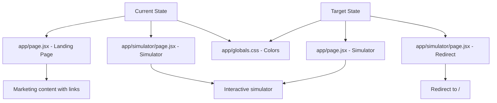

# Plan: Make Landing Page the Simulator

## Overview
Replace the current landing page (`app/page.jsx`) with the simulator functionality from `app/simulator/page.jsx`, ensuring all colors are consistent and the design makes sense.

## Current State

### Files
- **`app/page.jsx`** - Marketing landing page with links to simulator
- **`app/simulator/page.jsx`** - Full interactive simulator with all components
- **`app/globals.css`** - Color scheme with CSS variables
- **`data/constituencies.js`** - Party metadata including colors

### Color Scheme
The following colors are defined and should be consistent:

| Party | Color | Hex |
|-------|-------|-----|
| NC (Nepali Congress) | Green | `#22c55e` |
| UML (CPN-UML) | Red | `#ef4444` |
| Maoist | Dark Red | `#991b1b` |
| RSP (Rastriya Swatantra Party) | Blue | `#3b82f6` |
| RPP (Rastriya Prajatantra Party) | Purple | `#8b5cf6` |
| JSPN (Janata Samajbadi Party) | Pink | `#ec4899` |
| US (Unified Socialist) | Orange | `#f97316` |
| JP (Janamat Party) | Teal | `#14b8a6` |
| LSP (Loktantrik Samajbadi Party) | Light Purple | `#a855f7` |
| NUP (Nagrik Unmukti Party) | Cyan | `#06b6d4` |
| Others | Amber | `#f59e0b` |

### UI Colors
- **Background**: `rgb(246, 243, 236)` - Warm newsprint
- **Surface**: `rgb(255, 255, 252)` - Card/paper
- **Neutral**: `rgb(219, 211, 196)` - Borders + dividers
- **Foreground**: `rgb(24, 26, 36)` - Primary text
- **Muted**: `rgb(102, 110, 125)` - Secondary text
- **Accent Primary**: `#c03028` - Brick red
- **Accent Secondary**: `#1f3c88` - Deep navy

## Implementation Steps

### 1. Replace app/page.jsx with Simulator Content
- Copy the entire content from `app/simulator/page.jsx`
- Update the page component name to `HomePage` (or keep as default)
- Ensure all imports are correct for the new location
- Update import paths from `../../` to `../` since we're moving from `app/simulator/` to `app/`

### 2. Update Page Metadata
- Update title and description in `app/page.jsx` to reflect that this is now the main simulator page
- Keep the simulator-focused metadata from `app/simulator/page.jsx`

### 3. Handle the /simulator Route
Option A: Create a redirect
- Create `app/simulator/page.jsx` that redirects to `/`

Option B: Remove the route
- Delete `app/simulator/page.jsx` entirely

Option C: Keep both (not recommended)
- Keep duplicate pages (creates maintenance overhead)

**Recommended**: Option A (redirect) for SEO and user experience

### 4. Color Consistency Review
Ensure all components use the defined colors:
- Party colors from CSS variables and `data/constituencies.js`
- UI colors from `globals.css` CSS variables
- Accent colors for buttons and highlights

### 5. Test Components
Verify all simulator components render correctly:
- Header
- Party Sliders (FPTP and PR)
- Alliance/Gathabandan panel
- Bayesian Control Panel
- Switching Matrix
- Majority Bar
- PR Block Chart
- Coalition Builder
- Constituency Table/Map
- Results Summary
- Seat Drawer
- Alliance Modal

## Color Design Principles

### Party Colors
- Each party has a distinct, recognizable color
- Colors are consistent across all components (sliders, charts, maps, tables)
- Colors provide visual hierarchy and quick recognition

### UI Colors
- Warm, newsprint-style background for a professional, data-focused feel
- High contrast for readability
- Accent colors (brick red, deep navy) for CTAs and highlights
- Neutral borders for subtle separation

### Dark Mode Support
- Dark mode is defined in `globals.css` with adjusted values
- All components should respect the `data-theme` attribute

## Potential Issues to Address

1. **Import Paths**: When moving from `app/simulator/page.jsx` to `app/page.jsx`, import paths need adjustment
   - `../../components/` → `../components/`
   - `../../data/` → `../data/`
   - `../../hooks/` → `../hooks/`
   - `../../context/` → `../context/`

2. **Client Component**: The simulator is a client component (`'use client'`), which is appropriate for the main page

3. **Dynamic Imports**: The `ConstituencyMap` is dynamically imported with no SSR - this should remain

4. **Metadata**: Page metadata should reflect the simulator as the main feature

## File Changes Summary

| File | Action | Notes |
|------|--------|-------|
| `app/page.jsx` | Replace with simulator content | Update import paths |
| `app/simulator/page.jsx` | Convert to redirect or delete | Recommended: redirect to `/` |
| `app/globals.css` | No changes needed | Colors already defined |
| `data/constituencies.js` | No changes needed | Colors already defined |

## Mermaid Diagram

