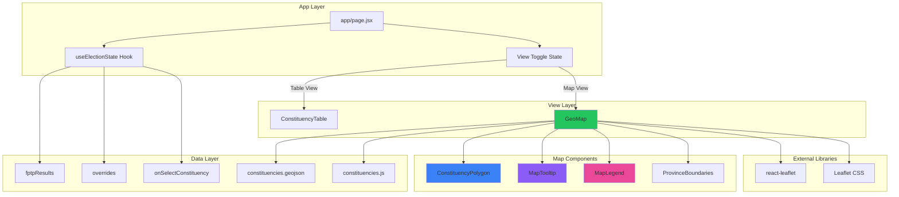
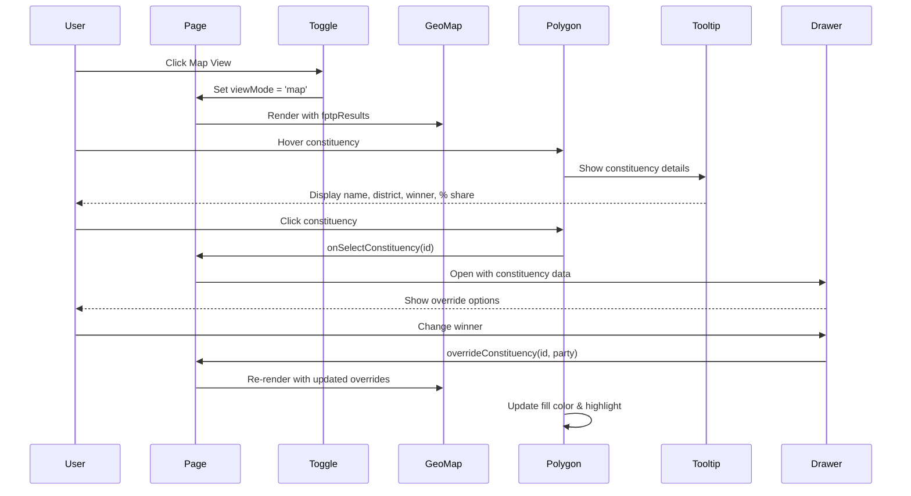

# Map Architecture & User Requirements

## User Requirements Summary

1. **View Toggle**: Add toggle button to switch between Table and Map views
2. **Dark Theme**: Use dark map tiles to match existing app design
3. **Interactive Features**:
   - Hover tooltips showing constituency details
   - Click to select constituency (opens override drawer)
4. **Complete Coverage**: Display all 165 constituencies

## System Architecture



## Component Interaction Flow



## Data Flow

### Election State Integration
```
useElectionState Hook
    ↓
    fptpResults: { [constituencyId]: { winner, share, margin, ... } }
    ↓
    GeoMap Component
    ↓
    ConstituencyPolygon (x165)
    ↓
    Fill color = PARTIES[winner].color
    Highlight = overrides[id] ? true : false
```

### GeoJSON Data Structure
```json
{
  "type": "FeatureCollection",
  "features": [
    {
      "type": "Feature",
      "properties": {
        "id": "P1-25",
        "name": "Bhojpur",
        "province": 1,
        "district": "Bhojpur"
      },
      "geometry": {
        "type": "Polygon",
        "coordinates": [[[lon, lat], ...]]
      }
    }
  ]
}
```

## Map Tile Options (Dark Theme)

### Recommended: CartoDB Dark Matter
```javascript
<TileLayer
  url="https://{s}.basemaps.cartocdn.com/dark_all/{z}/{x}/{y}{r}.png"
  attribution='&copy; <a href="https://www.openstreetmap.org/copyright">OpenStreetMap</a> contributors &copy; <a href="https://carto.com/attributions">CARTO</a>'
  maxZoom={19}
/>
```

### Alternative: Stamen Toner Dark (deprecated but good reference)
```javascript
<TileLayer
  url="https://stamen-tiles-{s}.a.ssl.fastly.net/toner-lines/{z}/{x}/{y}.png"
  attribution='Map tiles by <a href="http://stamen.com">Stamen Design</a>'
/>
```

### Alternative: Custom Dark Style (via MapTiler)
```javascript
<TileLayer
  url="https://api.maptiler.com/maps/dark-matter/{z}/{x}/{y}.png?key=YOUR_KEY"
  attribution='<a href="https://www.maptiler.com/copyright/" target="_blank">&copy; MapTiler</a>'
/>
```

## View Toggle Implementation

### State Management
```javascript
const [viewMode, setViewMode] = useState('table'); // 'table' | 'map'

const toggleView = () => {
  setViewMode(prev => prev === 'table' ? 'map' : 'table');
};
```

### UI Component
```jsx
<div className="flex items-center gap-2 mb-4">
  <span className="text-sm text-gray-400">View:</span>
  <button
    onClick={toggleView}
    className={`px-4 py-2 rounded-lg text-sm font-medium transition-colors ${
      viewMode === 'table'
        ? 'bg-surface border border-neutral text-white'
        : 'bg-transparent text-gray-400 hover:text-white'
    }`}
  >
    Table
  </button>
  <button
    onClick={toggleView}
    className={`px-4 py-2 rounded-lg text-sm font-medium transition-colors ${
      viewMode === 'map'
        ? 'bg-surface border border-neutral text-white'
        : 'bg-transparent text-gray-400 hover:text-white'
    }`}
  >
    Map
  </button>
</div>
```

## File Structure

```
nepalpoltiics/
├── data/
│   ├── constituencies.js              # Existing election data
│   └── constituencies.geojson         # NEW: Geographical boundaries
├── components/
│   ├── GeoMap.jsx                    # NEW: Main map component
│   ├── ConstituencyPolygon.jsx        # NEW: Polygon component
│   ├── MapTooltip.jsx                # NEW: Tooltip component
│   └── MapLegend.jsx                 # NEW: Legend component
├── app/
│   ├── globals.css                   # Add Leaflet CSS import
│   └── page.jsx                     # Add view toggle logic
└── package.json                     # Add react-leaflet dependency
```

## Installation Commands

```bash
# Install react-leaflet and leaflet
npm install react-leaflet leaflet

# If using TypeScript
npm install --save-dev @types/leaflet
```

## CSS Import

Add to `app/globals.css`:
```css
@import 'leaflet/dist/leaflet.css';
```

## Performance Considerations

1. **Polygon Simplification**: Use `turf.simplify()` to reduce coordinate points
2. **Memoization**: Use `useMemo` for GeoJSON processing
3. **Virtualization**: Only render visible polygons on zoom
4. **WebGL Renderer**: Enable for smoother rendering
5. **Lazy Loading**: Load GeoJSON data asynchronously

## Accessibility Features

1. **Keyboard Navigation**: Tab through constituencies, Enter to select
2. **Screen Reader Support**: ARIA labels on polygons
3. **Focus Indicators**: Visual focus states
4. **Color Contrast**: Ensure party colors meet WCAG AA standards
5. **Tooltip Persistence**: Keep tooltip visible for screen readers

## Testing Checklist

- [ ] All 165 constituencies render correctly
- [ ] Colors match winning parties
- [ ] Hover tooltips show correct data
- [ ] Click opens override drawer
- [ ] Manual overrides highlighted
- [ ] Province boundaries display
- [ ] Zoom/pan controls work
- [ ] View toggle switches correctly
- [ ] Responsive on mobile (320px+)
- [ ] Responsive on desktop (1920px+)
- [ ] Keyboard navigation works
- [ ] Performance smooth (60fps)
- [ ] No console errors
