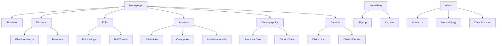
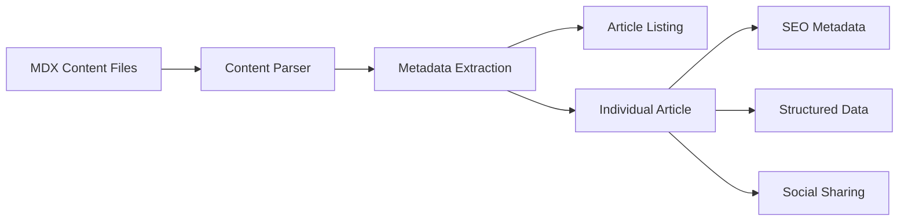

# Nepal Votes Website - Complete Architecture Plan

## Executive Summary

Transform the existing Nepal Election Simulator into a comprehensive data journalism website inspired by FiveThirtyEight (538), focusing exclusively on elections, polls, forecasts, and political commentary with bilingual support (Nepali/English).

## Current State Analysis

### Existing Features
- ✅ Interactive election simulator (FPTP/PR sliders)
- ✅ Historical election data (1991-2022)
- ✅ Demographics data by district/province
- ✅ Coalition builder and alliance features
- ✅ Seat projection calculations (Sainte-Laguë method)
- ✅ Next.js 14 with App Router
- ✅ Tailwind CSS styling
- ✅ Dark/light theme support

### Gaps to Address
- ❌ No blog/content management system
- ❌ No polling data aggregation
- ❌ No forecasting models
- ❌ No newsletter system
- ❌ No SEO optimization
- ❌ No bilingual support
- ❌ Limited navigation structure
- ❌ No social sharing
- ❌ No analytics integration

---

## Site Architecture

### Sitemap

```
/
├── /                          # Homepage - Featured content + Quick simulator access
├── /simulator                 # Full election simulator (current homepage)
├── /elections
│   ├── /                      # All elections overview
│   ├── /[year]                # Individual election details
│   └── /forecast              # Election forecasts and models
├── /polls
│   ├── /                      # All polls
│   ├── /[id]                  # Individual poll details
│   └── /trends                # Polling trends over time
├── /analysis
│   ├── /                      # All analysis articles
│   ├── /[slug]                # Individual article
│   └── /category/[category]   # Articles by category
├── /demographics              # Existing demographics page
├── /districts                 # Existing districts page
├── /about
├── /newsletter
│   ├── /                      # Newsletter signup
│   └── /archive               # Past newsletters
└── /api                       # API endpoints (if needed)
```

### Navigation Structure

**Primary Navigation:**
- Home
- Simulator
- Elections
- Polls
- Analysis
- Demographics
- Districts

**Secondary Navigation (Footer):**
- About
- Methodology
- Data Sources
- Newsletter
- Contact

---

## Content Types

### 1. Articles (MDX-based)

**Categories:**
- Election Forecasts
- Polling Analysis
- Demographic Insights
- Historical Analysis
- Policy Impact
- Opinion/Commentary

**Article Structure:**
```yaml
---
title: "Article Title"
titleNe: "नेपाली शीर्षक"
slug: "article-slug"
category: "forecasts"
author: "Author Name"
authorNe: "लेखकको नाम"
date: "2025-01-28"
tags: ["election-2027", "polls", "forecast"]
featuredImage: "/images/article.jpg"
excerpt: "Brief description..."
excerptNe: "छोटो विवरण..."
language: "both" # "en", "ne", or "both"
readTime: 5
---
```

### 2. Polls

**Poll Data Structure:**
```yaml
---
id: "poll-001"
title: "National Poll - January 2025"
pollster: "Kantipur Media Group"
methodology: "Phone survey, n=2000"
date: "2025-01-15"
sampleSize: 2000
marginError: 2.5
parties:
  NC: 28
  UML: 26
  Maoist: 12
  RSP: 15
  RPP: 6
  JSPN: 5
  US: 4
  Others: 4
---
```

### 3. Forecasts

**Forecast Model Structure:**
```yaml
---
id: "forecast-2027"
election: "2027 General Election"
model: "Nepal Votes Model"
lastUpdated: "2025-01-28"
confidence: "Medium"
projections:
  NC: 95
  UML: 88
  Maoist: 35
  RSP: 28
  RPP: 12
  JSPN: 10
  US: 4
  Others: 3
---
```

### 4. Newsletters

**Newsletter Structure:**
```yaml
---
id: "newsletter-001"
title: "Weekly Election Update - Week 4"
date: "2025-01-28"
issue: 4
summary: "This week's key developments..."
---
```

---

## Bilingual Support System

### Implementation Strategy

**1. Language Context Provider**
```javascript
// context/LanguageContext.js
export const LanguageContext = createContext({
  language: 'en', // 'en' or 'ne'
  toggleLanguage: () => {},
  t: (key, fallback) => fallback
})
```

**2. Content Translation Pattern**
```javascript
// lib/translations.js
export const TRANSLATIONS = {
  nav: {
    home: { en: 'Home', ne: 'गृहपृष्ठ' },
    simulator: { en: 'Simulator', ne: 'प्रतिरूपक' },
    elections: { en: 'Elections', ne: 'निर्वाचन' },
    // ...
  }
}
```

**3. URL Structure Options**

**Option A: Subdirectories (Recommended for SEO)**
```
/en/simulator
/ne/simulator
```

**Option B: Query Parameter**
```
/simulator?lang=en
/simulator?lang=ne
```

**Option C: Subdomains**
```
en.nepalvotes.com/simulator
ne.nepalvotes.com/simulator
```

**Recommendation:** Use Option A with Next.js internationalized routing for best SEO.

### MDX Content Handling

**Single File Approach (for bilingual content):**
```mdx
---
title: "Election Forecasts"
titleNe: "निर्वाचन पूर्वानुमान"
---

<Content>
  <English>
    # Election Forecasts
    Our models project the 2027 election...
  </English>
  <Nepali>
    # निर्वाचन पूर्वानुमान
    हाम्रो मोडलले २०७४ को निर्वाचन पूर्वानुमान गर्दछ...
  </Nepali>
</Content>
```

**Separate Files Approach:**
```
content/analysis/
├── election-forecasts.en.mdx
└── election-forecasts.ne.mdx
```

---

## SEO Optimization Strategy

### Technical SEO

**1. Next.js SEO Configuration**
```javascript
// next.config.js
module.exports = {
  images: {
    domains: ['cdn.nepalvotes.com'],
  },
  async headers() {
    return [
      {
        source: '/sitemap.xml',
        headers: [
          {
            key: 'Content-Type',
            value: 'application/xml',
          },
        ],
      },
    ]
  },
}
```

**2. Dynamic Metadata Generation**
```javascript
// lib/metadata.js
export function generateArticleMetadata(article, language) {
  return {
    title: language === 'ne' ? article.titleNe : article.title,
    description: language === 'ne' ? article.excerptNe : article.excerpt,
    openGraph: {
      title: language === 'ne' ? article.titleNe : article.title,
      description: language === 'ne' ? article.excerptNe : article.excerpt,
      images: [article.featuredImage],
      locale: language === 'ne' ? 'ne_NP' : 'en_US',
    },
    twitter: {
      card: 'summary_large_image',
      title: language === 'ne' ? article.titleNe : article.title,
      description: language === 'ne' ? article.excerptNe : article.excerpt,
      images: [article.featuredImage],
    },
    alternates: {
      canonical: `https://nepalvotes.com/analysis/${article.slug}`,
      languages: {
        en: `https://nepalvotes.com/en/analysis/${article.slug}`,
        ne: `https://nepalvotes.com/ne/analysis/${article.slug}`,
      },
    },
  }
}
```

**3. Sitemap Generation**
```javascript
// app/sitemap.js
export default function sitemap() {
  const baseUrl = 'https://nepalvotes.com'
  const routes = [
    '',
    '/simulator',
    '/elections',
    '/polls',
    '/analysis',
    '/demographics',
    '/districts',
    '/about',
  ]

  return routes.map((route) => ({
    url: `${baseUrl}${route}`,
    lastModified: new Date(),
    changeFrequency: 'daily',
    priority: 1,
  }))
}
```

**4. Robots.txt**
```javascript
// app/robots.js
export default function robots() {
  return {
    rules: {
      userAgent: '*',
      allow: '/',
      disallow: '/api/',
    },
    sitemap: 'https://nepalvotes.com/sitemap.xml',
  }
}
```

**5. Structured Data (JSON-LD)**
```javascript
// components/StructuredData.jsx
export function ArticleStructuredData({ article, language }) {
  const schema = {
    '@context': 'https://schema.org',
    '@type': 'NewsArticle',
    headline: language === 'ne' ? article.titleNe : article.title,
    description: language === 'ne' ? article.excerptNe : article.excerpt,
    image: [article.featuredImage],
    datePublished: article.date,
    dateModified: article.date,
    author: {
      '@type': 'Person',
      name: article.author,
    },
    publisher: {
      '@type': 'Organization',
      name: 'Nepal Votes',
      logo: {
        '@type': 'ImageObject',
        url: 'https://nepalvotes.com/logo.png',
      },
    },
    inLanguage: language === 'ne' ? 'ne-NP' : 'en-US',
  }

  return (
    <script
      type="application/ld+json"
      dangerouslySetInnerHTML={{ __html: JSON.stringify(schema) }}
    />
  )
}
```

### Content SEO

**1. Keyword Strategy**
- Primary: "Nepal election", "Nepal polls", "Nepal politics"
- Nepali: "नेपाल निर्वाचन", "नेपाल मतदान", "नेपाल राजनीति"
- Long-tail: "2027 Nepal election forecast", "Nepal election simulator"

**2. Meta Descriptions**
- Length: 150-160 characters
- Include primary keyword
- Compelling and click-worthy

**3. Image Optimization**
- Use WebP format
- Include alt text in both languages
- Lazy loading
- Responsive images

**4. Internal Linking**
- Related articles
- Topic clusters
- Breadcrumb navigation

**5. Page Speed**
- Image optimization (next/image)
- Code splitting
- Lazy loading components
- Minimize JavaScript

---

## UI/UX Improvements

### Homepage Redesign

**Hero Section:**
- Featured article with large image
- Quick access to simulator
- Latest polls summary
- Trending topics

**Content Grid:**
- Latest articles (3 columns)
- Popular articles sidebar
- Newsletter signup CTA
- Social proof (subscribers, etc.)

### Article Page Design

**Layout:**
- Full-width featured image
- Article title (bilingual toggle)
- Author info with avatar
- Publication date & read time
- Table of contents
- Social sharing buttons
- Related articles
- Newsletter signup

**Interactive Elements:**
- Poll charts embedded in articles
- Interactive data visualizations
- Expandable footnotes
- Citations with links

### Navigation Improvements

**Sticky Header:**
- Logo
- Primary navigation
- Language toggle
- Search
- Theme toggle
- Newsletter CTA

**Mobile Navigation:**
- Hamburger menu
- Slide-out drawer
- Touch-friendly

### Color Scheme Updates

**Maintain existing party colors:**
- NC: #22c55e (green)
- UML: #ef4444 (red)
- Maoist: #991b1b (dark red)
- RSP: #3b82f6 (blue)
- RPP: #8b5cf6 (purple)

**Add brand colors:**
- Primary: #0ea5e9 (sky blue)
- Secondary: #6366f1 (indigo)
- Accent: #f59e0b (amber)
- Success: #22c55e
- Warning: #f59e0b
- Error: #ef4444

---

## New Features to Implement

### 1. Polling Data System

**Components:**
- Poll aggregation dashboard
- Poll trend charts
- Pollster ratings
- Methodology explanations

**Data Structure:**
```javascript
// data/polls.js
export const POLLS = [
  {
    id: 'poll-001',
    title: 'National Poll - January 2025',
    pollster: 'Kantipur Media Group',
    methodology: 'Phone survey, n=2000',
    date: '2025-01-15',
    sampleSize: 2000,
    marginError: 2.5,
    results: {
      NC: 28,
      UML: 26,
      Maoist: 12,
      RSP: 15,
      RPP: 6,
      JSPN: 5,
      US: 4,
      Others: 4,
    },
    rating: 'A-',
  },
]
```

### 2. Forecasting Models

**Model Types:**
- Poll-only model
- Demographic model
- Historical model
- Ensemble model

**Visualization:**
- Probability distribution
- Seat projection ranges
- Win probability charts
- Scenario analysis

### 3. Newsletter System

**Implementation:**
- Email capture form
- Newsletter archive page
- Email template system
- Integration with email service (Resend, SendGrid, or Mailchimp)

**Newsletter Types:**
- Weekly election update
- Monthly analysis digest
- Breaking news alerts
- Special reports

### 4. Search Functionality

**Search Features:**
- Full-text search
- Filter by category
- Filter by date
- Filter by party/topic
- Search suggestions

**Implementation:**
- Client-side search (for MVP)
- Algolia or Meilisearch (for scale)

### 5. Social Sharing

**Share Buttons:**
- Facebook
- Twitter/X
- LinkedIn
- WhatsApp (popular in Nepal)
- Copy link

**Open Graph Tags:**
- Dynamic OG images
- Article-specific metadata
- Social media previews

### 6. Analytics Integration

**Tools:**
- Google Analytics 4
- Plausible (privacy-focused alternative)
- Vercel Analytics

**Track:**
- Page views
- Article engagement
- Simulator usage
- Newsletter signups
- Search queries

### 7. RSS Feeds

**Feed Types:**
- All articles
- By category
- Latest polls
- Newsletter archive

---

## Technical Implementation Plan

### Phase 1: Foundation (Core Infrastructure)

**Tasks:**
1. Set up MDX support
2. Create content directory structure
3. Implement language context
4. Set up bilingual routing
5. Create base layouts
6. Implement SEO utilities
7. Set up sitemap and robots.txt

**Files to Create:**
- `content/` directory structure
- `context/LanguageContext.jsx`
- `lib/translations.js`
- `lib/metadata.js`
- `lib/content.js` (MDX utilities)
- `components/StructuredData.jsx`
- `components/LanguageToggle.jsx`

**Files to Modify:**
- `next.config.js`
- `app/layout.jsx`
- `app/page.jsx`

### Phase 2: Content Management (MDX System)

**Tasks:**
1. Create MDX components
2. Build article listing page
3. Build individual article page
4. Implement category filtering
5. Add related articles
6. Create author pages

**Files to Create:**
- `components/mdx/` (MDX components)
- `app/analysis/page.jsx`
- `app/analysis/[slug]/page.jsx`
- `app/analysis/category/[category]/page.jsx`

**Sample Content:**
- `content/analysis/welcome-to-nepal-votes.mdx`
- `content/analysis/understanding-nepals-electoral-system.mdx`

### Phase 3: Polling System

**Tasks:**
1. Create polls data structure
2. Build polls listing page
3. Build individual poll page
4. Create poll trend charts
5. Implement pollster ratings

**Files to Create:**
- `data/polls.js`
- `app/polls/page.jsx`
- `app/polls/[id]/page.jsx`
- `app/polls/trends/page.jsx`
- `components/PollChart.jsx`
- `components/PollTrendChart.jsx`

### Phase 4: Forecasting Models

**Tasks:**
1. Design forecast data structure
2. Build forecast page
3. Create probability charts
4. Implement scenario analysis
5. Add model explanations

**Files to Create:**
- `data/forecasts.js`
- `app/elections/forecast/page.jsx`
- `components/ForecastChart.jsx`
- `components/ProbabilityDistribution.jsx`
- `components/ScenarioBuilder.jsx`

### Phase 5: Newsletter System

**Tasks:**
1. Create newsletter signup form
2. Build newsletter archive
3. Set up email integration
4. Design email templates
5. Implement RSS feeds

**Files to Create:**
- `app/newsletter/page.jsx`
- `app/newsletter/archive/page.jsx`
- `components/NewsletterSignup.jsx`
- `app/rss.xml`
- `app/rss/articles.xml`
- `app/rss/polls.xml`

### Phase 6: UI/UX Enhancements

**Tasks:**
1. Redesign homepage
2. Improve navigation
3. Add search functionality
4. Implement social sharing
5. Optimize mobile experience
6. Add loading states
7. Create error pages

**Files to Create:**
- `components/Search.jsx`
- `components/SocialShare.jsx`
- `components/ArticleCard.jsx`
- `components/FeaturedArticle.jsx`
- `components/LoadingSpinner.jsx`
- `app/not-found.jsx`
- `app/error.jsx`

### Phase 7: SEO & Performance

**Tasks:**
1. Implement structured data
2. Optimize images
3. Add meta tags
4. Create sitemap
5. Set up analytics
6. Performance audit
7. Core Web Vitals optimization

**Files to Modify:**
- `app/layout.jsx`
- `next.config.js`
- `app/sitemap.js`
- `app/robots.js`

### Phase 8: Testing & Launch

**Tasks:**
1. Test bilingual functionality
2. Test SEO implementation
3. Performance testing
4. Cross-browser testing
5. Mobile testing
6. Accessibility audit
7. Deploy to Vercel
8. Set up custom domain

---

## Dependencies to Add

```json
{
  "dependencies": {
    "@mdx-js/loader": "^3.0.0",
    "@mdx-js/react": "^3.0.0",
    "next-mdx-remote": "^4.4.1",
    "date-fns": "^3.0.0",
    "recharts": "^2.10.0",
    "lucide-react": "^0.300.0",
    "framer-motion": "^11.0.0",
    "clsx": "^2.0.0",
    "tailwind-merge": "^2.0.0"
  },
  "devDependencies": {
    "@types/mdx": "^2.0.0",
    "eslint-plugin-mdx": "^3.0.0"
  }
}
```

---

## File Structure (Final)

```
nepalpoltiics/
├── app/
│   ├── [lang]/
│   │   ├── layout.jsx
│   │   ├── page.jsx
│   │   ├── simulator/
│   │   │   └── page.jsx
│   │   ├── elections/
│   │   │   ├── page.jsx
│   │   │   ├── [year]/
│   │   │   │   └── page.jsx
│   │   │   └── forecast/
│   │   │       └── page.jsx
│   │   ├── polls/
│   │   │   ├── page.jsx
│   │   │   ├── [id]/
│   │   │   │   └── page.jsx
│   │   │   └── trends/
│   │   │       └── page.jsx
│   │   ├── analysis/
│   │   │   ├── page.jsx
│   │   │   ├── [slug]/
│   │   │   │   └── page.jsx
│   │   │   └── category/[category]/
│   │   │       └── page.jsx
│   │   ├── demographics/
│   │   │   └── page.jsx
│   │   ├── districts/
│   │   │   ├── page.jsx
│   │   │   └── [slug]/
│   │   │       └── page.jsx
│   │   ├── about/
│   │   │   └── page.jsx
│   │   ├── newsletter/
│   │   │   ├── page.jsx
│   │   │   └── archive/
│   │   │       └── page.jsx
│   │   ├── search/
│   │   │   └── page.jsx
│   │   ├── sitemap.js
│   │   └── robots.js
│   ├── layout.jsx
│   ├── page.jsx
│   ├── globals.css
│   └── rss.xml
├── components/
│   ├── mdx/
│   │   ├── MDXComponents.jsx
│   │   ├── CodeBlock.jsx
│   │   ├── Chart.jsx
│   │   ├── Table.jsx
│   │   └── Callout.jsx
│   ├── Header.jsx
│   ├── Footer.jsx
│   ├── Navigation.jsx
│   ├── LanguageToggle.jsx
│   ├── Search.jsx
│   ├── SocialShare.jsx
│   ├── ArticleCard.jsx
│   ├── FeaturedArticle.jsx
│   ├── PollChart.jsx
│   ├── PollTrendChart.jsx
│   ├── ForecastChart.jsx
│   ├── ProbabilityDistribution.jsx
│   ├── NewsletterSignup.jsx
│   ├── StructuredData.jsx
│   └── ThemeToggle.jsx
├── context/
│   └── LanguageContext.jsx
├── lib/
│   ├── translations.js
│   ├── metadata.js
│   ├── content.js
│   ├── seo.js
│   └── utils.js
├── content/
│   ├── analysis/
│   │   ├── welcome-to-nepal-votes.mdx
│   │   └── understanding-nepals-electoral-system.mdx
│   ├── polls/
│   │   └── sample-poll.mdx
│   └── newsletters/
│       └── sample-newsletter.mdx
├── data/
│   ├── constituencies.js
│   ├── historicalElections.js
│   ├── demographics.js
│   ├── polls.js
│   └── forecasts.js
├── public/
│   ├── images/
│   ├── logos/
│   └── icons/
├── plans/
│   └── nepal-votes-website-architecture.md
├── package.json
├── next.config.js
├── tailwind.config.js
└── tsconfig.json
```

---

## Deployment Strategy

### Vercel Configuration

**1. Environment Variables:**
```env
NEXT_PUBLIC_SITE_URL=https://nepalvotes.com
NEXT_PUBLIC_GA_ID=G-XXXXXXXXXX
EMAIL_API_KEY=your_email_service_key
```

**2. vercel.json:**
```json
{
  "buildCommand": "npm run build",
  "outputDirectory": ".next",
  "framework": "nextjs",
  "regions": ["hkg1"],
  "headers": [
    {
      "source": "/(.*)",
      "headers": [
        {
          "key": "X-Content-Type-Options",
          "value": "nosniff"
        },
        {
          "key": "X-Frame-Options",
          "value": "DENY"
        }
      ]
    }
  ]
}
```

**3. Custom Domain Setup:**
- Purchase domain (e.g., nepalvotes.com)
- Add domain in Vercel dashboard
- Configure DNS records
- Set up SSL (automatic with Vercel)

---

## Content Strategy

### Initial Content (Launch)

**Essential Pages:**
1. About page (bilingual)
2. Methodology page (bilingual)
3. Data sources page (bilingual)
4. Welcome article
5. Electoral system explainer

**Sample Articles:**
- "How Nepal's Mixed Electoral System Works"
- "Understanding the Sainte-Laguë Method"
- "A History of Nepal's Elections: 1991-2022"
- "Demographic Trends and Their Impact on Elections"
- "The Rise of RSP: What 2022 Told Us"

### Content Calendar

**Weekly:**
- 1-2 analysis articles
- 1 poll update (if data available)
- 1 newsletter

**Monthly:**
- 1 deep-dive feature
- 1 forecast update
- 1 historical analysis

**Election Season:**
- Daily updates
- Real-time forecasts
- Live results coverage

---

## Success Metrics

### KPIs to Track

**Traffic:**
- Monthly unique visitors
- Page views
- Average session duration
- Bounce rate

**Engagement:**
- Article read time
- Social shares
- Comments (if enabled)
- Newsletter subscribers

**SEO:**
- Organic search traffic
- Keyword rankings
- Backlinks
- Domain authority

**Simulator Usage:**
- Daily active users
- Scenario saves
- Time spent in simulator

---

## Risks & Mitigation

### Technical Risks

**Risk:** MDX performance issues
**Mitigation:** Implement caching, use static generation where possible

**Risk:** Bilingual content maintenance overhead
**Mitigation:** Create translation workflow, use translation tools

**Risk:** Data accuracy issues
**Mitigation:** Source transparency, peer review, methodology documentation

### Content Risks

**Risk:** Limited polling data in Nepal
**Mitigation:** Focus on analysis and historical data, partner with pollsters

**Risk:** Political sensitivity
**Mitigation:** Maintain neutrality, cite sources, provide balanced perspectives

**Risk:** Content burnout
**Mitigation:** Evergreen content, repurpose data, guest contributors

---

## Next Steps

1. **Review this plan** - Ensure it aligns with your vision
2. **Prioritize phases** - Decide which features to implement first
3. **Set up development environment** - Install new dependencies
4. **Start Phase 1** - Foundation and core infrastructure
5. **Create sample content** - Populate with initial articles
6. **Test thoroughly** - Bilingual support, SEO, performance
7. **Launch on Vercel** - Deploy to production
8. **Iterate based on feedback** - Improve based on user data

---

## Questions for Review

1. Do you want to implement all phases, or prioritize specific ones?
2. Should we start with a MVP (minimal viable product) or full feature set?
3. Do you have a preferred email service for newsletters?
4. What's your timeline for launch?
5. Do you have content contributors or will you write everything yourself?
6. Should we include comments/discussion on articles?
7. Do you want user accounts for saving simulator scenarios?
8. Should we implement a podcast or video content section?

---

## Mermaid Diagrams

### Site Architecture Overview



### Content Flow



### Bilingual Routing

```mermaid
flowchart LR
    A[User Request] --> B{Language?}
    B -->|en| C[/en/...]
    B -->|ne| D[/ne/...]
    C --> E[English Content]
    D --> F[Nepali Content]
    E --> G[Render Page]
    F --> G
```

---

*Last Updated: January 28, 2025*

